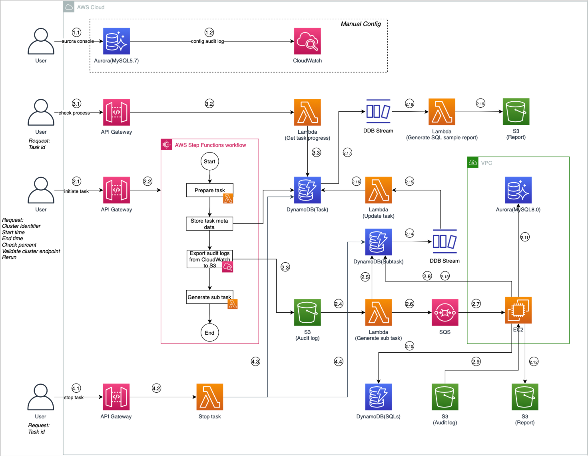

# queries-check-audit-log

This tool collects SQL statements executed on Aurora 2(MySQL 5.7) from Audit logs within a specified time period and validates their compatibility by running them on Aurora 3(MySQL 8.0). It exports Audit logs from CloudWatch log groups to S3 buckets, extracts SQL statements from these logs, and performs syntax validation on an Aurora 3(MySQL 8.0) database. This allows you to identify and update any SQL statements with compatibility issues before proceeding with the Aurora version upgrade.

### Architecture



### Deployment Guideline

#### Prerequisites

* Enable audit logging for the Aurora 2(MySQL 5.7) database that needs to be checked. We recommend setting server_audit_events to QUERY_DML only, as this will help reduce CloudWatch costs for audit logging.
* Create a Secret Manager secret key containing username and password for accessing the MySQL 8.0 database. The parameter name during deployment will be <secret>.
* If you need to replay SQL statements in MySQL 8.0, prepare a MySQL 8.0 database created from the current 5.7 database snapshot.
* Identify the VPC where deployment is needed. The Aurora 3(MySQL 8.0) database must be in the same VPC. Type in the VPC ID as parameter <VPC ID>.
* When collecting traffic, we need to deploy agent EC2 instances. The EC2 instances must be deployed in at least one public subnet with at least 1 available IP. Use this public subnet ID as parameter <public subnets ID>. If deploying to a private subnet, ensure the EC2 instances in that subnet have a route to NAT Gateway. Additionally, the private subnet should preferably have endpoints for S3, SQS, and DynamoDB.
* Ensure the security group used by EC2 has access to the 8.0 database created from the snapshot.
* A Keypair for SSH access to Linux servers in this account and region. Use this Keypair name as parameter <keypair name>.
* Finally, as the deployer, you need at least permissions to deploy CDK code and use the Cloudshell service.


#### Deployment Steps

Search for Cloudshell service in AWS console, or open the cloudshell console:
Taking Singapore region as an example:
https://ap-southeast-1.console.aws.amazon.com/cloudshell/home?region=ap-southeast-1

```shell
unzip queries-check-audit-log.zip

cd queries-check-audit-log

pip3 install -r requirements.txt

cdk bootstrap -c env=<environment name> \
-c vpc=<VPC ID> \
-c public_subnets=<public subnets ID> \
-c keypair=<Keypair name> \
-c secret=<secret>

# Example: cdk deploy -c env=jtaudit \
# -c vpc=vpc-03a127cc0f579bb1f \
# -c public_subnets=subnet-09c5d0be751b927f4 \
# -c keypair=fox-key-sg \
# -c secret=rds\!cluster-64cbc4f0-1832-424f-a006-1398adb07530 

cdk deploy -c env=<environment name> \
-c vpc=<VPC ID> \
-c public_subnets=<public subnets ID> \
-c keypair=<Keypair name> \
-c secret=<secret> 
```
After deployment is complete, you can refer to the following API documentation for testing.

### API documentation

This solution implements 3 APIs:
1. Start Check Task API
2. View Task Progress and Report API
3. Stop API

API example: https://8xxxx.execute-api.ap-southeast-1.amazonaws.com/prod/task
When using these APIs, you need to include an x-api-key in the Headers. You can find the corresponding value in the AWS Console under API Gateway service. Navigate to API Keys in the left sidebar and copy your corresponding API key.


#### Start Check Task API(Method: POST)

Request body:
```json
{
  "cluster_identifier": "high-speed-db",
  "start_time": "2024-10-09 00:00",
  "end_time": "2024-10-09 23:59",
  "check_percent": 1,
  "validate_cluster_endpoint": "high.ap-southeast-1.rds.amazonaws.com",
  "rerun": true
}
```

Parameter Description:
1. rerun: Controls whether to perform actual SQL validation against MySQL 8.0
        true: Performs validation checks
        false: Only generates sample_sql.csv report without validation
2. check_percent: Controls SQL sampling rate to run on Aurora 3(MySQL 8.0) database, Value range: integers from 1 to 10,  1: Samples 10% of SQLs , 10: Samples 100% of SQLs (checks all statements).

Response:
```json
{
    "task_id": "string",
    "message": "string"
}
```

The task_id is a unique identifier for this task. Other APIs require this ID to perform operations specific to a check task. The message field contains error information and is empty by default.


#### View Task Progress and Report API(Method: GET)

Request：

?task_id=xxxx

Response, The Response content depends on the task status:

```json
{
    "task_id": "4642a902-9c96-43e4-8895-f95e59ec63a0", # task unique ID
    "cluster_identifier": "high-speed-db",
    "start_time": "2024-10-09 00:00",
    "end_time": "2024-10-09 23:59",
    "check_percent": 1,
    "rerun": true,
    "validate_cluster_endpoint": "high.ap-southeast-1.rds.amazonaws.com",
    "created_time": "2024-10-11T13:57:36.723Z",
    "status": "Completed", # Created，Initiated, In progress，Finished，Stopped, Error
    "update_time": "2024-10-11 14:48:51.447798",
    "error_message": "",
    "total_count": 13277552, # total checked query count
    "error_count": 13273,  # error query count after running on Aurora3(MySQL 8.0)
    "warning_count": 0,
    "error_report": "s3://bucket/report/taskid_high-speed-db/error.csv",
    "warning_report": "s3://bucket/report/taskid_high-speed-db/warning.csv",
    "sample_sql_report": "s3://bucket/report/taskid_high-speed-db/sample_sql.csv"
}
```


#### Stop API(Method: PUT)

Request body:
```json
{
    "task_id": "string"
}
```

The task_id is a unique identifier for this task. 

Response:
```json
{
    "message": "string"
}

```
The message field contains error information and is empty by default.


Enjoy!
